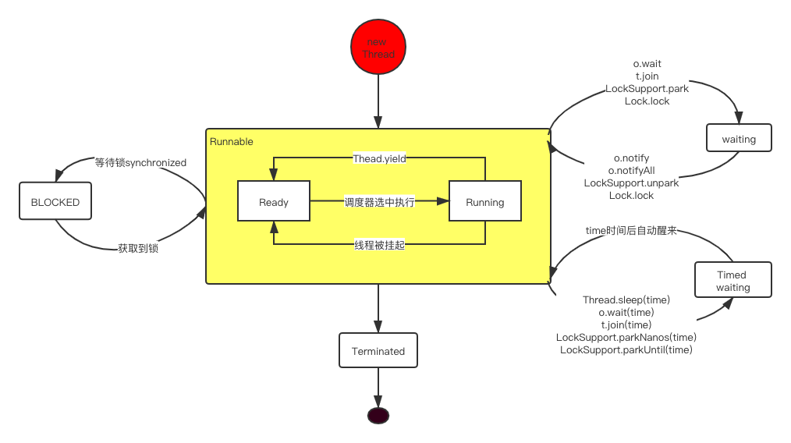

# 面试：Java线程有哪几种状态，它们之间是如何切换的

多线程历来是面试重灾区，有时对多线程的掌握程度决定了开发者的级别。想掌握多线程还是需要在实际工作中多应用。

而实际上经常用多线程开发的开发者并不多。但面试要问怎么办，只能是面向面试来学习。各个击破，事半功倍。

### 状态概述

今天我们来聊聊多线程之状态。这些状态是申明在了 `java.lang.Thread.State` 的枚举里。

```java
for (Thread.State state : Thread.State.values()) {
    System.out.println(state);
}
打印结果：
NEW
RUNNABLE
BLOCKED
WAITING
TIMED_WAITING
TERMINATED
```

1. New 初始化状态
2. Runnable 可执行状态，包含Ready状态和Running状态，当线程start()方法被调用，线程处于可被线程调度器选中执行的状态，就是Ready。待到被执行时就是Running状态。等获得CPU时间片后变为运行中状态*Running*。
4. Waiting  等待被唤醒
5. Timed waiting 等待一段时间后自动唤醒
6. Blocked 线程阻塞，等待锁
7. Terminated 线程结束

### 状态如何切换

切换图：


* 简单状态切换 NEW -> RUNNABLE -> TERMINATED

```java
Thread t1 = new Thread(()->{
    System.out.println("Thread go!");
    try {
        Thread.sleep(2);
    } catch (InterruptedException e) {
        e.printStackTrace();
    }

});

//NEW
System.out.println("执行new后状态 1：：" + t1.getState());
t1.start();
//RUNNABLE
System.out.println("执行start后状态 2：：" + t1.getState());
//等待线程执行完毕
t1.join();
//TERMINATED
System.out.println("执行join后的状态 3：：" + t1.getState());

打印结果：
执行new后状态 1：：NEW
执行start后状态 2：：RUNNABLE
Thread go!
执行join后的状态 3：：TERMINATED
```

* WAITING & TIMED_WAITING

```java
Thread t2 = new Thread(() -> {
    LockSupport.park();
    System.out.println("t2 run begin");
    try {
        //睡眠3s
        TimeUnit.SECONDS.sleep(3);
    } catch (InterruptedException e) {
        e.printStackTrace();
    }
});

t2.start();
//主线程睡眠1s
TimeUnit.SECONDS.sleep(1);
System.out.println("t2 park：" + t2.getState());//WAITING
//唤醒t2
LockSupport.unpark(t2);
//主线程睡眠1s：确认t2被叫醒
TimeUnit.SECONDS.sleep(1);
System.out.println("t2 unpark：" + t2.getState());//TIMED_WAITING1
```

* Blocked

  ```java
  final Object o = new Object();
  Thread t3 = new Thread(() -> {
      synchronized (o) {
          System.out.println("t3 start！");
      }
  });
  
  
  Thread t4 = new Thread(() -> {
      synchronized (o) {
          try {
              Thread.sleep(5);
          } catch (InterruptedException e) {
              e.printStackTrace();
          }
          System.out.println("t4 start");
      }
  });
  
  //t4 start拿到锁
  t4.start();
  
  //主线程睡一秒，保证t4已经拿到锁
  Thread.sleep(1);
  
  //t3 start竞争锁
  t3.start();
  
  Thread.sleep(1);
  System.out.println("t3状态：" + t3.getState());//Blocked
  ```

### 总结

这个小知识点比较简单，就不多做解释。积沙成塔，祝福金三银四面试成功。

学习就是今天比昨天进步一点点，加油Coder！